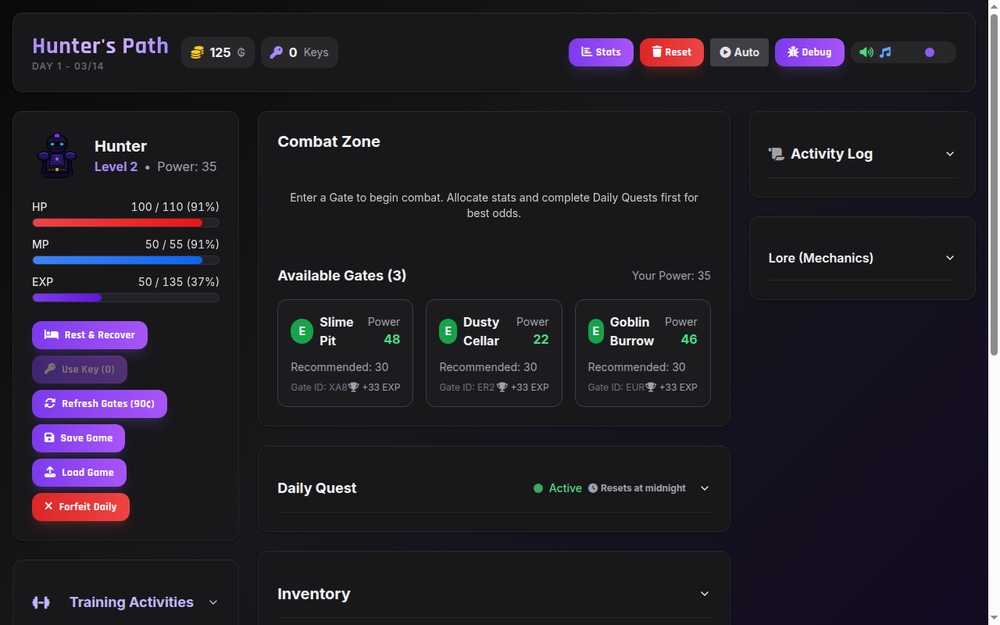
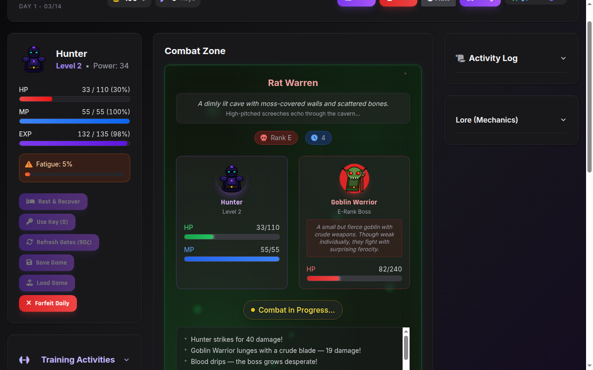
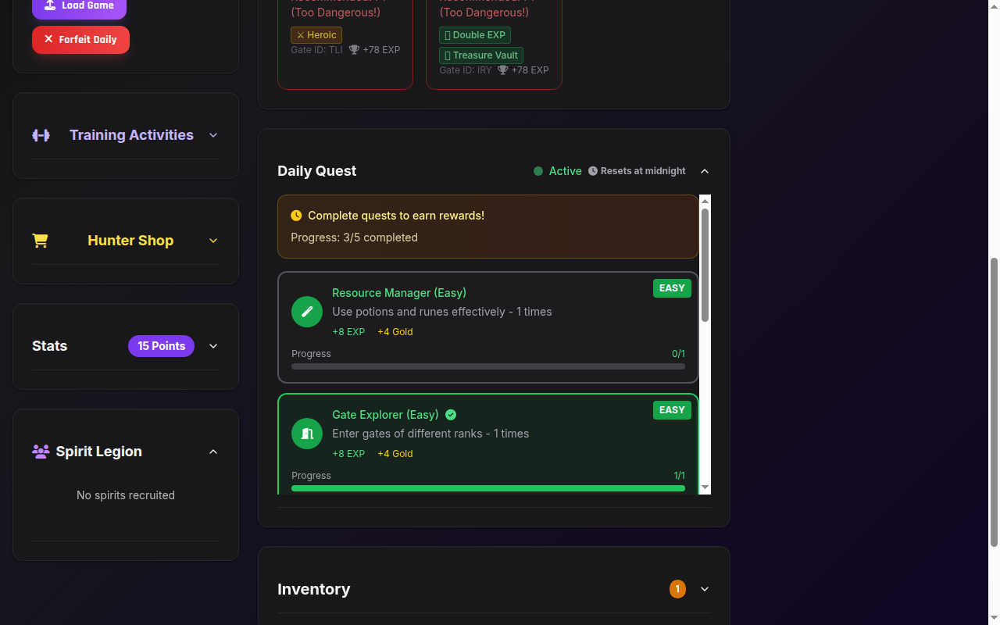
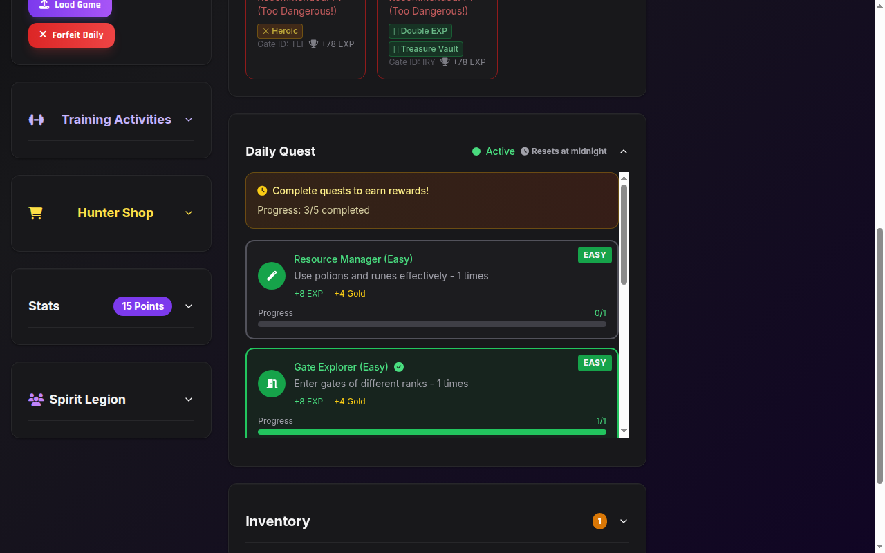
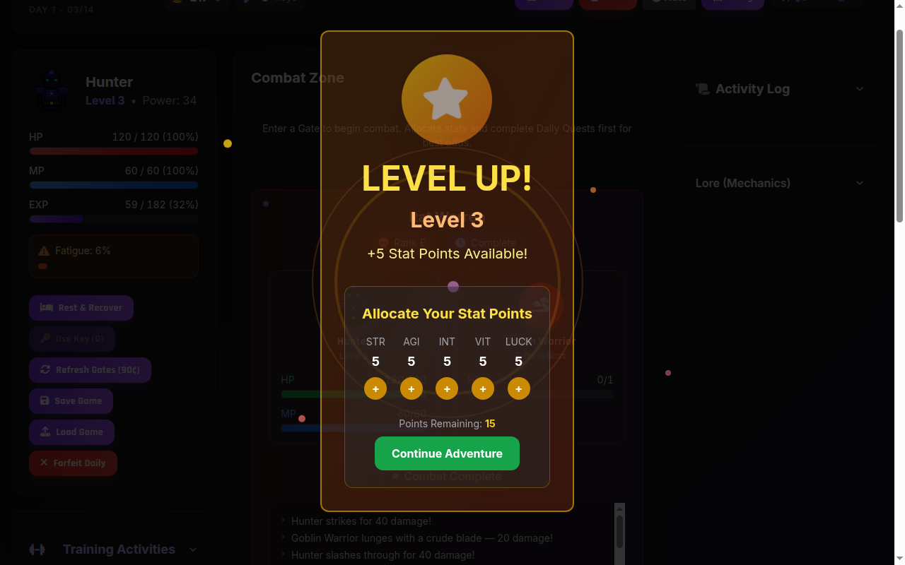
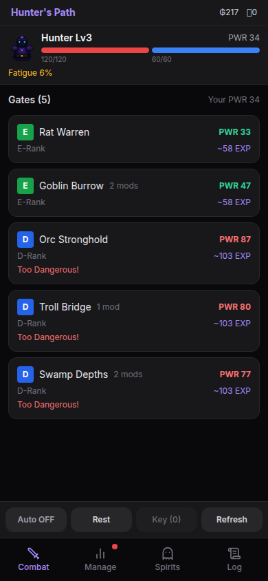

# Hunter's Path

[](https://github.com/jesserweigel/HunterPath/actions/workflows/deploy-github-pages.yml)

An idle RPG inspired by Solo Leveling, built as a Progressive Web App. Clear gates, fight bosses, bind spirits, manage fatigue, complete daily quests, and prestige your way to S-Rank. Playable offline on any device.

**[Play Now](https://jesserweigel.github.io/HunterPath/)**

## Screenshots

| Main Game | Combat | Spirits & Quests |
|:---------:|:------:|:----------------:|
|  |  |  |

| Daily Quests | Level Up & Stats | Mobile View |
|:------------:|:----------------:|:-----------:|
|  |  |  |

## Features

### Combat & Dungeons
- **Gate System** - Enter dungeon gates ranked E through S with scaling difficulty
- **Boss Fights** - Tick-based combat against unique bosses (Goblin Warrior to Void Lord)
- **Dungeon Modifiers** - Random buffs/debuffs per gate (Double EXP, Empowered Boss, Heroic, etc.)
- **Auto-Dungeon** - AFK farming with smart gate selection based on your power level
- **Loot Drops** - Potions, runes, equipment, and Instant Dungeon Keys

### Progression
- **Stat Allocation** - Distribute points across STR, AGI, INT, VIT, and LUCK
- **Leveling** - Exponential XP curve with 5 stat points per level
- **Rebirth/Prestige** - Reset for prestige points; unlock permanent upgrades (EXP boost, spirit power, fatigue resist, etc.)
- **Story Milestones** - Narrative beats at key levels with boss intro cinematics and first-clear celebrations

### Spirits
- **Spirit Binding** - Extract spirits from defeated bosses (chance scales with INT + LUCK)
- **5 Spirit Types** - Warrior, Mage, Rogue, Tank, Support — each with unique passive/active abilities
- **Rarity Tiers** - Common through Legendary with increasing power multipliers
- **Spirit Upkeep** - Bound spirits drain MP per combat tick

### Economy & Quests
- **Daily Quest System** - 5 quests per day across combat, exploration, collection, skill, and challenge types
- **Quest Reputation** - Build rep to unlock epic-tier quests with bonus stat points
- **Penalty Zone** - Forfeit dailies at your own risk
- **Hunter Shop** - Buy potions, keys, and consumables
- **Equipment** - Weapons, armor, and accessories from gate drops

### Survival
- **Fatigue System** - Accumulates during combat and training; reduces damage output up to 40%
- **Training Activities** - Physical training, mental training, meditation (fatigue recovery), and work jobs
- **Potion System** - HP/MP healing that scales with player level and potion quality

### Quality of Life
- **PWA** - Install on mobile/desktop, works fully offline
- **Auto-Save** - localStorage persistence with save data integrity
- **Responsive UI** - Desktop panel layout + dedicated mobile tab interface
- **Audio & Haptics** - Sound effects and vibration feedback
- **Lore System** - Unlockable story entries as you progress

## Tech Stack

| Layer | Technology |
|-------|-----------|
| **Frontend** | React 18, TypeScript, Vite |
| **UI** | Tailwind CSS, shadcn/ui (Radix primitives), Framer Motion |
| **State** | React hooks, React Query |
| **Backend** | Express.js, Node.js |
| **Database** | PostgreSQL via Neon Serverless, Drizzle ORM |
| **Audio** | Howler.js |
| **PWA** | Service Worker, Web App Manifest |
| **Testing** | Vitest, Testing Library, jsdom |
| **Deployment** | GitHub Actions, GitHub Pages |

## Getting Started

### Prerequisites

- Node.js 18.18.0+
- npm

### Install & Run

```bash
git clone https://github.com/jesserweigel/HunterPath.git
cd HunterPath
npm install
npm run dev
```

Open [http://localhost:5000](http://localhost:5000) to play.

### Build for Production

```bash
npm run build
npm start
```

## Project Structure

```
HunterPath/
├── client/src/
│   ├── components/
│   │   ├── game/
│   │   │   ├── HuntersPath.tsx      # Main game component (state, combat loop, UI)
│   │   │   ├── bosses/              # Animated boss SVG components (E-S rank)
│   │   │   ├── mobile/              # Mobile-specific layout and tabs
│   │   │   └── sections/            # Desktop UI panels (Stats, Inventory, Quests, etc.)
│   │   └── ui/                      # shadcn/ui component library
│   ├── lib/game/                    # Pure game logic (testable, no React)
│   │   ├── gameLogic.ts             # Player power, spirit upkeep, extraction chance
│   │   ├── gameUtils.ts             # clamp, rand, uid, fmt, pick
│   │   ├── gateSystem.ts            # Gate generation, bosses, drops, modifiers
│   │   ├── spiritSystem.ts          # Spirit creation, rarity, abilities
│   │   └── questSystem.ts           # Daily quest generation, difficulty scaling
│   └── hooks/                       # Custom React hooks
├── server/
│   ├── index.ts                     # Express server setup
│   ├── routes.ts                    # API route registration
│   ├── storage.ts                   # In-memory storage (user CRUD)
│   └── db.ts                        # Neon PostgreSQL + Drizzle connection
├── shared/
│   └── schema.ts                    # Drizzle ORM schema (users, gameStates, gateRuns, etc.)
├── .github/workflows/               # GitHub Actions deployment
├── vitest.config.ts                 # Test configuration
└── vite.config.ts                   # Build configuration
```

## Testing

The test suite covers game mechanics, React components, server storage, and schema validation.

```bash
# Run all tests
npm test

# Run tests in watch mode
npm run test:watch

# Run tests with coverage report
npm run test:coverage
```

### Coverage

| Area | Coverage |
|------|----------|
| **Game logic** (gameLogic, gameUtils, gateSystem, spiritSystem, questSystem) | 97-100% |
| **React components** (ErrorBoundary, Stats, DailyQuest, ActivityLog) | Render + interaction tests |
| **Server** (MemStorage CRUD) | Full interface coverage |
| **Schema** (Zod validation) | All insert schemas validated |

### Test Structure

Tests are colocated next to their source files:

```
gameLogic.ts      → gameLogic.test.ts
gateSystem.ts     → gateSystem.test.ts
Stats.tsx         → Stats.test.tsx
storage.ts        → storage.test.ts
```

## Deployment

Every push to `main` triggers automatic deployment to GitHub Pages via GitHub Actions:

1. Install dependencies
2. Build with Vite (output to `dist/public/`)
3. Deploy to GitHub Pages with HTTPS

The PWA service worker caches assets for offline play after first visit.

### Manual Deploy

```bash
npm run build
# Upload dist/public/ to any static host
```

## Game Mechanics Reference

### Power Formula

```
basePower = STR×3 + AGI×2 + INT×1.5 + VIT×0.5
spiritBonus = Σ(spirit.power) × (1 + spiritBoostLevel × 0.02)
fatiguePenalty = 1 - min(0.4, fatigue/250)
rebirthMult = 1 + rebirths × 0.15

totalPower = max(1, (basePower + spiritBonus) × fatiguePenalty × rebirthMult)
```

### Gate Difficulty Scaling

```
gatePower(rank) = round(1.7^rankIdx × 30 + rankIdx × 20)

E=30  D=71  C=127  B=200  A=304  S=454
```

### Rank Unlock Levels

| Rank | Level Required |
|------|---------------|
| E | 1 |
| D | 3 |
| C | 6 |
| B | 10 |
| A | 15 |
| S | 18 |

## Contributing

1. Fork the repository
2. Create a feature branch (`git checkout -b feature/my-feature`)
3. Write tests for new game logic
4. Make sure `npm test` passes
5. Submit a pull request

## License

MIT License — see [LICENSE](LICENSE) for details.
